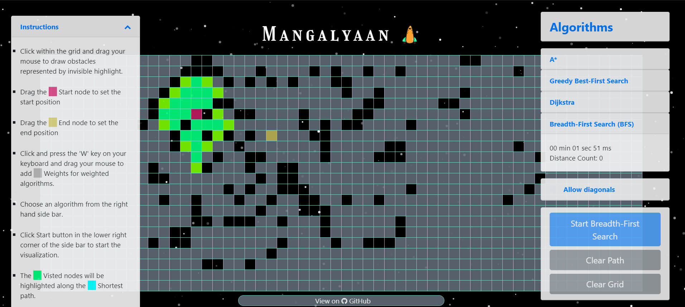
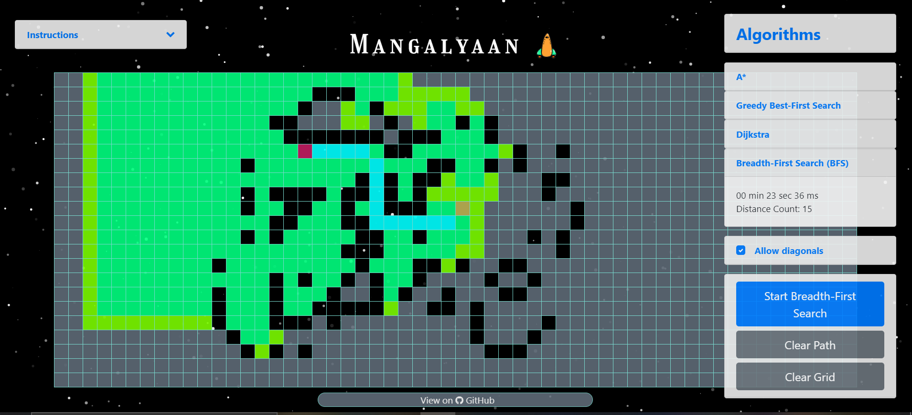
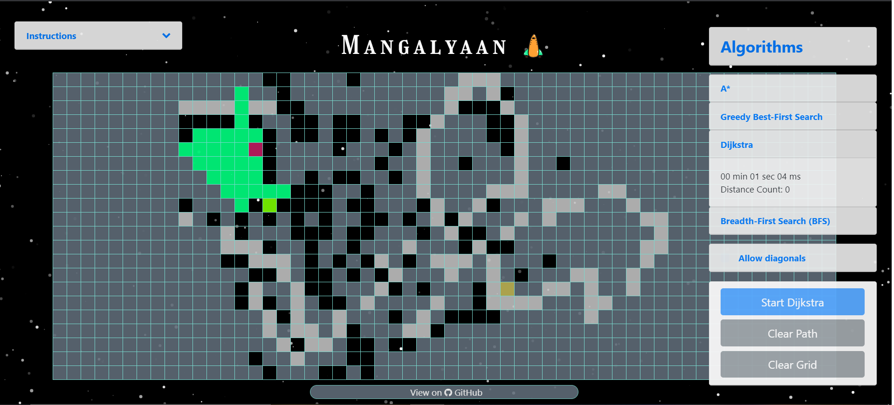
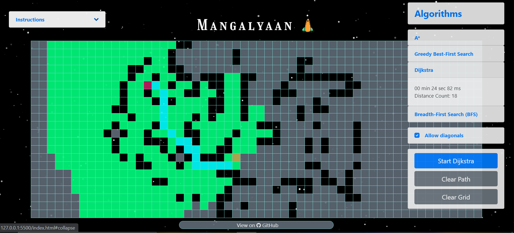
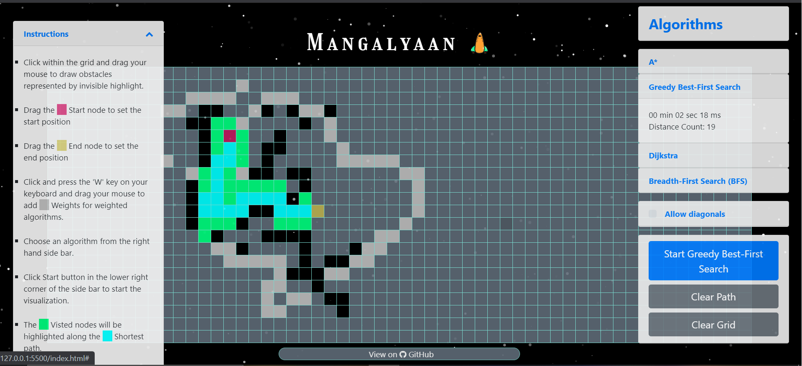
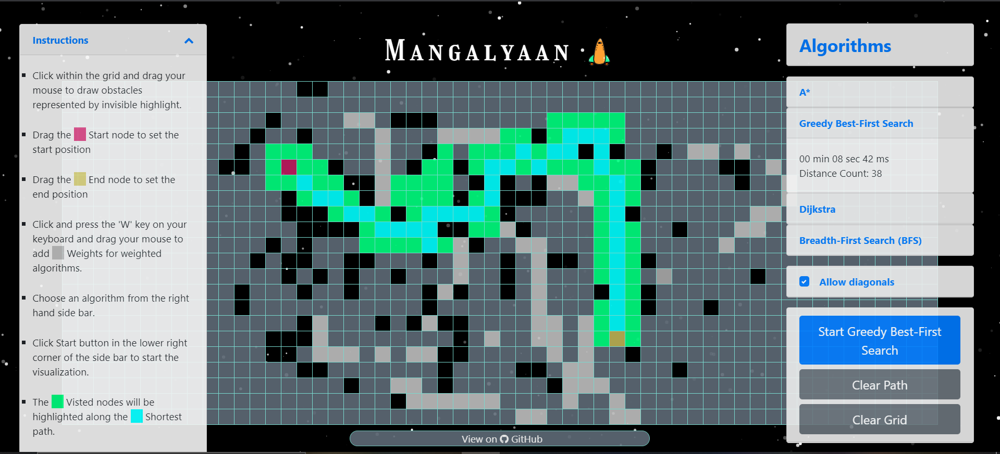
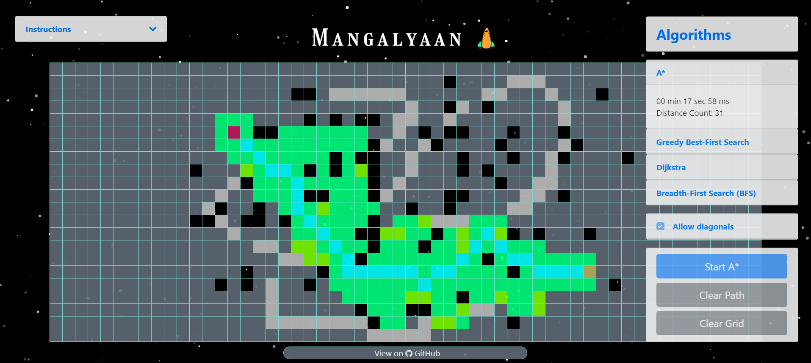
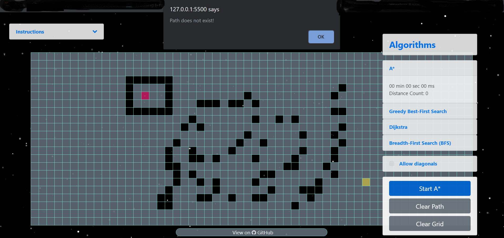

# Mangalyaan
Mangalyaan web application is a visualizing tool that helps the Mars rover (Mangalyaan) to find the shortest path between a start point and an end point using artificial intelligence search algorithms. Mangalyaan's main objective is to assist the crew that is chosen to establish a permenant human settlement on Mars, by providing the optimized paths between the departing point and the destination point. Mangalyaan is an intelligent machine, that is, it can be programmed to take actions or make choices/decisions based on input from sensors and the information provided to it. It is an entity which acts, directing its activity towards achieving goals that is to find optimized path to the destination while avoiding all the obstacles like big huge rocks and minimizing cost by circumventing rough terrains. This cost might include cost of wear and tear of the rover and cost of energy wasted.
Different algorithms are observed and applied to help the mangalyaan to become intelligent and make smart decisions.

#  What it can do
It is developed to find the shortest path between two points while avoiding obstacles.

#  How it works
It uses pathfinding algorithms to find the shortest path between two points.

# Getting Started
These instructions will get you a copy of the project up and running on your local machine for development and testing purposes. See documentation for notes on how to deploy the project on a live system.

Prerequisites:
What things you need to install the software and how to install them
node.js

# Documentation
For documentation,
https://github.com/soumyaa1804/PathFinding-Visualization/wiki

# Demo
For the demo, 
https://mangalyaan.netlify.app/

#  Use of ARTIFICIAL INTELLIGENCE
Most of the algorithms used to help make the rover an intelligent agent are the AI search algorithms. As the rover has intelligence in a specific field that is to find the shortest path with minimum cost it is considered to be using weak artificial intelligence. It perceives information like if there are obstacles in the way or a rough terrain (weights that increases cost) via sensors and from this observation it makes decisions and with the help of actuators it proceeds and takes action. 
The mangalyaan acts as a rational agent meaning it has a clear preference and acts in a way to maximize its perfomance and give the best possible results.
The intelligence of this rover depends on the algorithms being used and how the use of different algorithms affect the results is mentioned below.

# Algorithms

## Uninformed Searches
The uninformed search does not contain any domain knowledge such as closeness, the location of the goal. It operates in a brute-force way as it only includes information about how to traverse the tree and how to identify leaf and goal nodes.

### 1. Breadth First Search Algorithm
Breadth-first search (BFS) is an algorithm for traversing or searching tree or graph data structures. It starts at the start Node in the grid, and explores all of the neighbour nodes at the present depth prior to moving on to the nodes at the next depth level. It can be implemented using FIFO queue data structure. It is an unweighted algorithm.
 
 

 
 

 
 

 
 

### 2. Dijkstra's Algorithm
Dijkstra's algorithm find the shortest path between two given nodes, but a more common variant fixes a single node as the "source" node and finds shortest paths from the source to all other nodes in the graph, producing a shortest-path tree.
Although in our case we are making a small change by passing the information about the target node so that the algorithm can work efficiently.
 
 

 
 

 
 

 
 

## Informed Searches
Informed search algorithms use domain knowledge. In an informed search, problem information is available which can guide the search. Informed search strategies can find a solution more efficiently than an uninformed search strategy. Informed search is also called a Heuristic search.

A heuristic is a way which might not always be guaranteed for best solutions but guaranteed to find a good solution in reasonable time.

### 1. Greedy Best-First Search Algorithm
Greedy best-first search algorithm always selects the path which appears best at that moment. It is the combination of depth-first search and breadth-first search algorithms. It uses the heuristic function and search. Best-first search allows us to take the advantages of both algorithms. With the help of best-first search, at each step, we can choose the most promising node. In the best first search algorithm, we expand the node which is closest to the goal node and the closest cost is estimated by heuristic function, i.e.
f(n)= h(n).   
Were, h(n)= estimated cost from node n to the goal.
 
 

 
 

 
 

 
 

### 2. A* Algorithm
A* search is the most commonly known form of best-first search. It uses heuristic function h(n), and cost to reach the node n from the start state g(n). It has combined features of UCS and greedy best-first search, by which it solve the problem efficiently. A* search algorithm finds the shortest path through the search space using the heuristic function. This search algorithm expands less search tree and provides optimal result faster. A* algorithm uses g(n)+h(n).
 
 

 
 

 
 

 
 
# Unique Features

### Rough Terrain Region
The Martian surface contains thousands of impact craters because, unlike Earth, Mars has a stable crust, low erosion rate, and no active sources of lava. So, impact craters on Mars are not obliterated as they are on Earth. These rough terrains are very damaging for the mangalyaan to pass through to reach the destination, hence to avoid such wear and tear of the machine and excess use of energy which directly increases the costs, we have introduced extra costs (weights) to the nodes where the users want these rough terrain to be so that it can help rover avoid these crater pits and reach its target point efficiently with minimum cost possible.
The weighted algorithms that are dijkstra's algorithm, A* algorithm and Greedy Best-First Algorithm consider these weights and try to get the path which is the most optimized one, whereas Breadth-First Search algorithm is unweighted algorithm so the application does not allow user to enter weights.

### Warning - NO PATH FOUND
Some times the obstacles surround the starting point and there exist no path to the destination point, in that case the application foretell and alerts the user - **NO PATH FOUND**.
 
 

 
 
### Contributors
- [Anusha Bansal](https://github.com/AnushaKittu)

- [Soumya Sharma](https://github.com/soumyaa1804)

### References
https://www.javatpoint.com/search-algorithms-in-ai
 
https://en.wikipedia.org/wiki/Artificial_intelligence
https://www.youtube.com/watch?v=sZ0z7B7QmjI
http://theory.stanford.edu/~amitp/GameProgramming/
